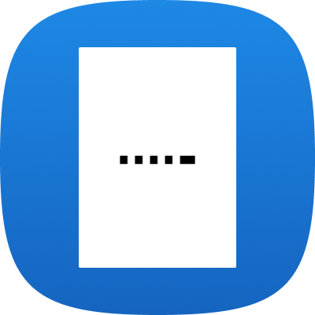
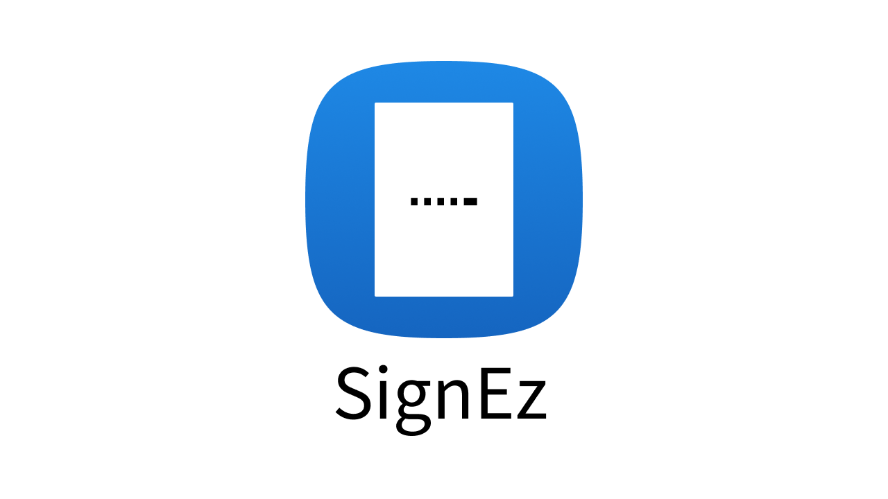
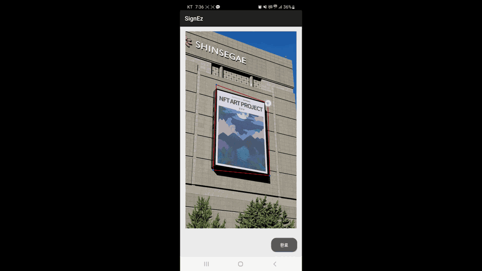
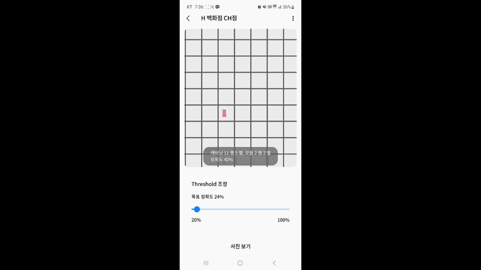

# SignEz - Signage ProblemShooting Solution

>

<h3> Signage 문제, SignEz로 해결하세요

 

## 🪴 **Introduce**

> 기존 Signage 문제해결 프로세스는 문제 영상/사진 촬영, 이미지 분류, 문제 위치 파악 등 여러 단계를 거쳐 진행되고 있습니다.
> 이러한 과정은 번거롭고 인적 자원과 비용적인 측면에서 비효율적인 면이 있으며, 문제해결의 정밀도와 정확도에도 한계가 존재합니다.

> 현행 프로세스의 비효율성과 정확도 부족은 빠른 시일 내에 문제를 해결하는 데 어려움을 초래하고 있습니다.
> 이에 따라 향상된 문제 해결 방안이 필요하다는 생각되었습니다.

> **SignEz** 프로젝트는 기존 프로세스의 단계들을 하나의 어플리케이션으로 통합하여 사용자의 편의성을 높이고, 머신러닝 기술을 적용하여 문제해결의 정밀도와 정확도를 개선하고자 합니다.
> 이를 통해 전반적인 Signage 문제해결 과정의 효율성을 높이고, 예상 사용자인 설치업체와 QA에게 더 나은 문제해결 경험을 제공하려고 합니다.

 

## 🎥 **소개 영상**

- [UCC 바로가기](https://youtu.be/uSm4YDu5cFg)

 

## 🕘 **프로젝트 진행 기간**

- **2023.02.20(월) ~ 2023.04.07(금)**

## ☃️ **Team**

<table>
 <tr>
    <td align="center"><a href="https://github.com/grolarkim"></td>
    <td align="center"><a href="https://github.com/KangDue"></td>
    <td align="center"><a href="https://github.com/SSangRRae"></td>
    <td align="center"><a href="https://github.com/YoonsikOh5"></td>
    <td align="center"><a href="https://github.com/"></td>
    <td align="center"><a href="https://github.com/HHyoS"></td>
  </tr>
  <tr>
    <td align="center">팀장, ML</td>
    <td align="center">Android</td>
    <td align="center">ML</td>
    <td align="center">Android</td>
    <td align="center">ML</td>
    <td align="center">ML</td>
  </tr>
     <tr>
    <td align="center"><a href="https://github.com/grolarkim"><b>김명준</b></td>
    <td align="center"><a href="https://github.com/KangDue"><b>강기한</b></td>
    <td align="center"><a href="https://github.com/SSangRRae"><b>김상래</b></td>
    <td align="center"><a href="hhttps://github.com/YoonsikOh5"><b>오윤식</b></td>
    <td align="center"><a href="https://github.com/"><b>진윤태</b></td>
    <td align="center"><a href="https://github.com/HHyoS"><b>황효상</b></td>
  </tr>

</table>
     
 

## 📍 PPT

- **[최종 발표 PPT](https://drive.google.com/drive/folders/1arW7T25XFIs4wlZCQjDpa6VOl8Ldpun0?usp=sharing)**

 

## 🧾 프로젝트 산출물

- [컨벤션](https://handsome-linen-cba.notion.site/Git-Branch-Strategy-Commit-Convention-0ab0e506c0d2477abd50a0e2039cb003)
- [기능명세서](https://handsome-linen-cba.notion.site/e72d1e82c0ca4bf7994e010c72cf91e0?v=5960ffe7f30a44fca147d2b4436ad866)
- [Gantt Char](https://handsome-linen-cba.notion.site/Gantt-Chart-6a6df79f994649cbbcb5b5ba534de3d1)
- [회고록](https://handsome-linen-cba.notion.site/7141d1e7db3c4a2c837fee1a40ae7cde)
   

## ✔️ 주요 기능

> **SignEz**

  

 

- **문제 해결 솔루션(SignEz)**

  - Android OS기반 Kotlin으로 개발한 어플리케이션.
  - 삼성 One Ui를 앱 디자인에 적용
  - ML을 사용한 Obeject & Error Detection
  - 사용자의 입력으로 데이터의 확장 가능
  - 이전 결과를 DB에 저장하여 재분석 가능

- **Add Infomation**

  - SignEz에는 현재까지 설치되어있는 삼성의 모든 Signage에 대한 정보가 들어있어, Signage ErrorDetection에 사용할 수 있습니다.
  - Signage가 추가/변경되는 경우, '사이니지 스펙 입력'화면에서 Signage에 대한 정보를 수정/추가할 수 있습니다.

- **Signage Detection**

  - 영상/사진 분석화면에서 '분석하기' 버튼을 누르면 ML을 통해 Signage Detection을 실행하고, Signage의 좌표를 네 점으로 표시해줍니다.
  - 사용자의 네 점을 이동해서 사이니지 화면에 맞게 세부조정을 할 수 있습니다.

- **Error Detection**

  - Signage Detction에서 Signage위치를 정하면 ErrorDection 기능이 실행됩니다.
  - Error Detection은 Signage Detection에서 정한 위치를 바탕으로 Corner Detection을 진행하여 꼭지점을 찾습니다.
  - 위의 방법을 통해 영상에서 사람의 손이 흔들리더라도 꼭지점을 갱신하여 Error Detection을 수행합니다.
  - 동작 순서는 다음과 같습니다.
    - 꼭지점 찾기
    - 사이니지 화면 펴기
    - 주어진 영상/사진을 Frame 단위로 확인하며 ML 수행
    - ErrorDetection이 되면 해당 Frame을 저장하기

- **Analysis of results**

  - 에러 발생모듈을 Hitmap 형식으로 표현
  - Slider를 사용하여 ErrorDetection의 정확도인 Threshold를 변경할 수 있습니다.
  - 정확도에 따라 Hitmap에 표시되는 에러가 달라지며, 에러 터치시 위치를 세부 정보를 확인할 수 있습니다.
  - 에러를 터치한 상태에서 하단의 사진보기를 누르면 실제 사진에서 에러모듈을 확인할 수 있습니다.

 

## &#128187; 서비스 화면

## **Main화면**

> Main화면에서는 1)사이니지 정보입력 2)영상 분석 3)사진 분석 세 가지 기능이 있습니다. 

 

### **사이니지 정보 입력**

>사이니지 정보입력 기능은 분석할 대상인 사이니지의 정보를 입력/수정/삭제 하는 기능으로 기본적으로 현재 설치된 모든 사이니지의 정보가 담겨있습니다. 
>만약 사용자가 사이니지의 정보가 변경되거나 수정될 경우 사용자가 내용을 수정할 수 있습니다. 

 

### **영상 분석 / 사진 분석**

>영상/사진 분석기능은 입력한 사이니지 정보를 바탕으로 분석을 진행하는 기능입니다. 
> 분석하는 사진/영상을 직접 촬영하거나 갤러리에서 선택하여 분석을 진행합니다. 
> [분석하기] 버튼을 누르면 ML을 통해 사이니지의 위치를 탐색하여, 사이니지가 존재하는 범위를 4개의 점으로 표시해줍니다. 
> 사용자의 제공된 점을 이동시켜 사이니지의 화면에 맞게 정밀조작 할 수 있습니다.

 

### **Error Detect**

> Error Dection기능은 선택한 영상/사진과 사이니지 위치를 기준으로 에러를 탐색하는 기능입니다. 
> 에러를 탐색하는 기능은 [Corner Detection] 과 [Error Dection]두가지로 구성되어 있습니다. 
> [Corner Detection]은 [분석하기]에서 선택한 점을 기준으로 가장 가까운 코너를 선택하여 사각형의 꼭지점으로 선택하는 기능으로, 사용자가 정확한 사이니지의 위치를 지정하지 않더라도 가장 가까운 꼭지점을 선택하기 때문에 영상에서 발생하는 손떨림 등에 의한 위치변동 또한 잡아낼 수 있습니다.
> [Corner Detection] 이후에는 꼭지점을 바탕으로 사각형을 정하고, OpenCv를 사용해서 해당 사각형을 직사각형으로 펴주는 작업을 수행합니다.
> [Error Dection]은 [Corner Detction]에서 만들어진 사각형을 이용하여 에러를 탐지하는 기능입니다. Yolov5를 사용하여 에러 모듈의 위치를 찾아내고, 해당 데이터를 바탕으로 Hitmap 형식으로 표현해줍니다.

 

### **에러모듈 확인**

 

> 에러모듈 확인 기능은 Hitmap에서 발견된 에러모듈의 정보를 확인하는 기능입니다. 
> Hitmap에서 에러 모듈로 보이는 빨간점을 선택할 경우 에러 모듈의 위치정보를 확인할 수 있습니다.  
> 에러모듈 선택 후 하단의 [사진보기] 버튼을 클릭하면 해당 모듈이 에러라고 판단되는 프레임과, 에러모듈의 위치를 사용자에게 보여줍니다.

# 프로젝트 후기

7주동안 프로젝트를 위해 같이 고민해주신 멘토님들 너무 감사드리고 팀원들 모두 수고했어! 사....사랑한다!

