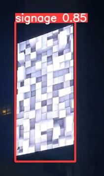
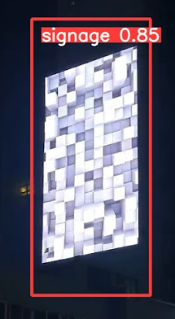

# Today What I DO

## ML yolact, yolact++ 학습 및 테스트

    - 사이니지에 대한 검출 정확도가 떨어지고, 그 외의 다른 사물을 사이니지로 잡는 결과가 발생하여 폐기

## yolov5 코드수정 및 테스트

    - yolov5 로 테스트할경우 사이니지를 검출하지만, 화면이 짤려서 검출되는 케이스 발생

    - 따라서 사이니지 검출 프로세스를 다음과 같이 변경
        1. yolov5를 사용하여 사이니지를 검출.
            1-1. 사이니지를 검출하는 detect.py에서 사용하는 모듈인 an.py 를 수정하여 사각형 크기 키우기
        2. 사각형 내에서 opencv로 사이니지 검출하기
    
    - 사각형 중심 기준으로 20% 크기를 증가시키는 코드

            p1, p2 = (int(box[0]), int(box[1])), (int(box[2]), int(box[3]))
            center_x, center_y = (p1[0] + p2[0]) // 2, (p1[1] + p2[1]) // 2
            w, h = p2[0] - p1[0], p2[1] - p1[1]
            new_w, new_h = int(w * 1.2), int(h * 1.2)
            new_p1 = np.array([center_x, center_y]) - np.array([new_w // 2, new_h // 2])
            new_p2 = np.array([center_x, center_y]) + np.array([new_w // 2, new_h // 2])
            cv2.rectangle(self.im, tuple(new_p1), tuple(new_p2), color, thickness=self.lw, lineType=cv2.LINE_AA)

    - 결과 

    증가 전

    증가 후 

